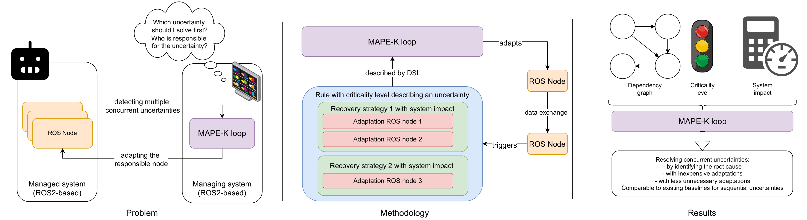
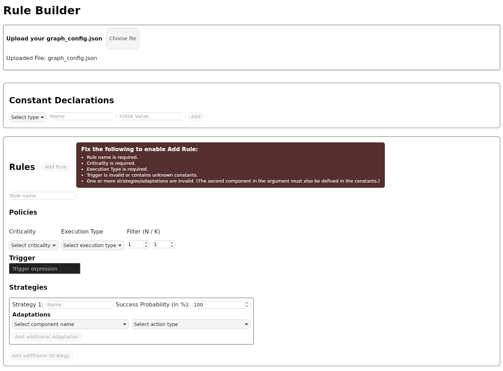
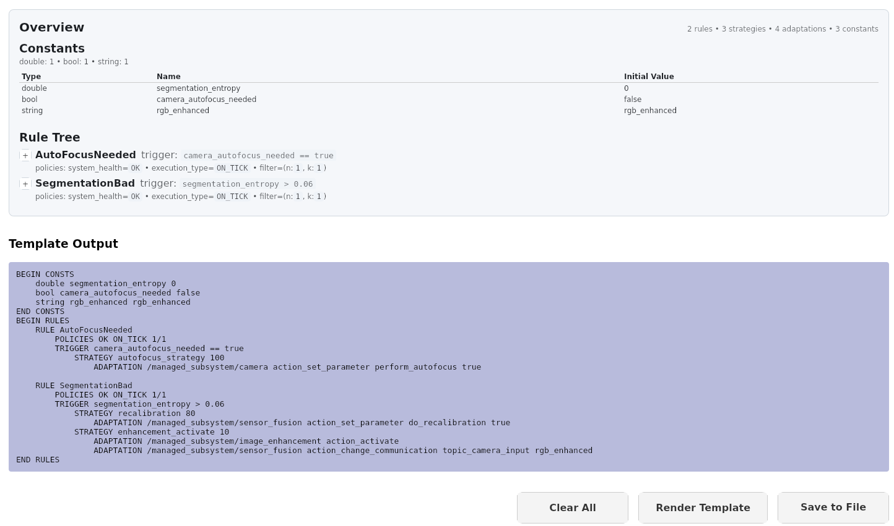

# Resolving concurrent failures in ROS systems




# Getting started

[[_TOC_]]

## Requirements

- Docker (necessary)
- CUDA (optional if you want to run the segmentation models in the managed subsystem on the GPU)

## Additional data

Download the segmentation models and the ros bags with test data from the a server with the scp command (password `seams`, fingerprint: SHA256:2JiosHIjBy/5rI8HJsrVCtHeCwRsajRPMWcLrqMKjxs):

```bash
scp seams-reviewer@65.108.55.103:/home/seams-reviewer/data.zip .
```

Unzip and place it inside the ros_ws as a ".data" folder.

```
ros_ws
├── .data
│   ├── chckpoints
│   │   ├── depth.pth
│   │   ├── fusion.pth
│   │   └── rgb.pth
│   └── SynDrone_t01_h50.bag
```

## Replication of results for our ablation study

Run the experiment from the root of the repository with 

```bash
bash ./ros_ws/evaluation/run_multi_experiment.sh
```
The logs will be stored in a folder `log_dump` next to the ros_ws directory.

## Evaluation of log files
To calculate the results in our table, for each table there are scripts in the [experiment_setup folder](./ros_ws/src/experiment_setup/experiment_setup/)
To retrieve our log files you can get them from the same server as above:


## Replication of our results for sequential uncertainties
Use the image described in [this Dockerfile](./Dockerfile).
This has the SUAVE environment installed. 
Mount the [suave_ws](./suave_ws) into the docker container which includes the [adapted bash script](./suave_ws/src/suave/runner/rosa_runner.sh) to start the SUAVE exemplar with our managing system.
You can start the experiment with

```bash
./rosa_runner.sh false bt_mape_k <extended | time> <number runs>

```

## Development

There is a devcontainer file, i.e. you can just open VSCode in the root of this repository and reopen VSCode in the devcontainer.
This should do the rest.

In case you want to visualize the Behaviour Tree that will be run, install [Groot2](https://www.behaviortree.dev/groot/) whereever you like. 
Live visualization is only available in the Pro Version of Groot2 anyway, so we don't bother with that.


## Set up your own experiment

You need three files:
- `graph_config.json` – needed / blacklisted nodes (namespaces + node names)
- `main_bt.xml` – generated Behavior Tree
- `rules.txt` – adaptation rules (see [Rules for adaptation](#rules-for-adaptation))

Workflow:
1. Run `setup_file_generator.py` (experiment_setup package). It discovers all running ROS 2 nodes and lets you:
   - include / exclude namespaces
   - include / exclude remaining nodes one by one
2. The script writes:
   - `graph_config.json` into the mapek package (config folder)
   - `main_bt.xml` into the bt_mape_k package (bts folder)
3. Build `rules.txt` using the rule_creation GUI (see tools/rule_builder). Load your graph_config.json so component names are available.
4. Render and save rules.txt into bt_mape_k/bts.
5. Launch your experiment.

Rule elements (in the GUI):
- Name
- Policies:
  - Criticality: OK, DEGRADED, FAILURE
  - Execution Type: ON_TICK, ON_CHANGE
  - Filter: n/k 
- Trigger:
  - Must match the regex in ExpressionFactory.hpp (mapek package)
  - Uses constants you define
- Strategies:
  - Name
  - Success probability (%)
  - Adaptations:
    - Component (from graph_config.json)
    - Action Type: activate, deactivate, restart, redeploy, change_communication, set_parameter, increase_parameter, decrease_parameter, change_mode
    - Argument (only for change_communication, set_parameter, increase/decrease_parameter, change_mode)
      - Second argument must be a declared constant or valid expression

Example screens:






# Structure of the repo

## Top-level
```
mapek-bt/
├── Dockerfile / Dockerfile.cuda / Dockerfile.eval.cuda
├── .devcontainer/
├── ros_ws/
├── suave_ws/
├── tools/
├── docs/
├── figures/
├── log_dump/
├── log/
├── repoStructure.md
└── README.md
```

- Dockerfiles: Container builds (CPU baseline, CUDA for GPU models, eval for lightweight analysis).
- `.devcontainer/`: VS Code development environment (mounts `ros_ws`, sets up colcon + dependencies).
- `ros_ws/`: Primary ROS 2 workspace (packages described below).
- `suave_ws/`: Workspace for the suave use case.
- `tools/`: Standalone helper scripts (bag creation, figure generation, graph tests, subsystem representation, rule builder).
- `docs/`: Domain-specific language layout, UML, examples.
- `figures/`: PNG/SVG diagrams used in documentation/paper.
- `log_dump/`: Aggregated experiment result logs (CSV/JSON) copied from runs.
- `log/`: Build and runtime logs with timestamped folders and `latest` symlinks.

## `ros_ws` core packages
```
ros_ws/src/
├── bt_mape_k/
├── mapek/
├── managed_subsystem/
├── experiment_setup/
├── python_base_class/
├── system_interfaces/
```

### BT_MAPE_K

This package contains the implementation of the Behaviour Tree. 
The [bt_exectutor](ros_ws/src/bt_mape_k/src/bt_executor.cpp) is responsible for building the BT and executing it.
The implementation of the nodes is in the [include](ros_ws/src/bt_mape_k/include/bt_mape_k) directory and in the according src files.

All BTs we develop in this paper can be stored in the [bts](ros_ws/src/bt_mape_k/bts) directory.

- Purpose: Behavior Tree assembly and execution; bridges rules DSL + runtime adaptation.
- Key dirs: `bts/` (XML trees, rules files, init JSON), `include/bt_mape_k/` (custom nodes), `src/` (`bt_executor.cpp`).

### mapek
- Purpose: Implements Monitor, Analyze, Plan, Execute of our approach.
- Key dirs: `src/` (e.g., `analyzer.cpp`), `config/` (dependency graph, blackboard init), `tests/`.
- Role: Correlates executed strategies to rules; manages adaptation timing windows.

### system_interfaces

This package contains all custom interfaces that we need in order to implement the MAPE-K loop.

### Managed Subsystem

This package contains the full managed subsystem.
- Purpose: Adapted system components (camera, depth, enhancement, fusion, segmentation).
- Degradation controls via parameters: `image_degradation`, `depth_degradation`.
- Key dirs: `managed_subsystem/` (Python implementation), `launch/`, `resources/` (scenarios/configs), `test/`.

#### Camera node

The camera node can artificially degrade the incoming image from the rosbag by shifting it towards a darker spectrum.

Use the parameter 
- `image_degradation` to set the degradiation from `0.0=no degradation` to `1.0=maximum degradation`.
- `do_drop_camera` to drop images, can be resolved by restarting the node
- `do_hard_drop_camera` to drop images, can only be resolved by redeploying the node

#### Depth node

The depth node can artificially degrades the incoming depth by adding noise to simulate unreasonable data at higher altitudes.

Use the parameter `depth_degradation` to set the degradiation from `0.0=no degradation` to `1.0=maximum degradation`.

#### Image enhancement node

The image enhancement node tries to reverses the image shift by normalizing the image mean and standard deviation to a constant value.

#### Sensor fusion node

The sensor fusion node synchronizes the data streams from the camera, lidar and enhancement.

Use the parameter
- `topic_camera_input` to set the rgb input to either `/rgb_camera` or `/rgb_enhanced`
- `modality` to set the fusion to `0=fusion`, `1=rgb` or `2=depth`.
- `do_drop_sensor_fusion` to drop images, can be resolved by restarting the node
- `do_hard_drop_sensor_fusion` to drop images, can only be resolved by redeploying the node

#### Segmentation node

The Segmentation node takes the fused data as input and outputs a predicted segmentation.
Use the parameter
- `do_drop_segmentation` to drop images, can be resolved by restarting the node
- `do_hard_drop_segmentation` to drop images, can only be resolved by redeploying the node

### Experiment setup

This package contains all logic that is necessary for running a full experiment.

Use `ros2 launch experiment_setup experiment.launch.py` to run the full managed subsystem and all evaluation nodes.

The ros bag needs to be started seperately with `ros2 bag play .data/SynDrone_t01_h50.bag --clock`. Make sure to choose the `Dockerfile.cuda` in the devcontainer configuration when using a GPU. Note the `--clock` flag which is necessary to sync the time of the system with the ros bag time in combination with the `use_sim_time=true` flag for all nodes.

#### Evaluator

This node will compare the ground truth segmentation with the segmentation generated by the system. The results are directly logged via a [logger](./ros_ws/src/experiment_setup/experiment_setup/experiment_logger.py) that writes the results into a csv.

#### Scenario executor

This node will create specific failure scenarios based on a yaml file.

See `ros_ws/src/experiment_setup/resources/scenarios` for example uses and required keys for each event type.

## Python Base class

This package contains the base class that will be used by every node in the managed subsystem.
For examples how to use the base class follow the instructions in the next section.

# Configuration

## Rules for adaptation

Current approach for designing a domain specific language for rule definition:
```
BEGIN CONSTS
    double segmentation_entropy 0.0
    double managed_subsystem_depth_camera_freq 2.
    double managed_subsystem_rgb_camera_freq 2.
    double managed_subsystem_segmentation_freq 2.
    double managed_subsystem_sensors_fused_freq 2.
    bool camera_autofocus_needed false
    string rgb_enhanced rgb_enhanced
    string rgb_raw rgb_camera
    int don_t 1
    int know 1
END CONSTS
BEGIN RULES
    RULE AutoFocusNeeded
      POLICIES OK ON_TICK 1/1
      TRIGGER camera_autofocus_needed == true 
      STRATEGY autofocus_strategy 100
          ADAPTATION /managed_subsystem/camera action_set_parameter perform_autofocus true

    RULE SegmentationBad
      POLICIES DEGRADED ON_TICK 1/1
      TRIGGER segmentation_entropy > 0.06
      STRATEGY recalibration 80
          ADAPTATION /managed_subsystem/sensor_fusion action_set_parameter do_recalibration true
      STRATEGY enhancement_activate 12
          ADAPTATION /managed_subsystem/image_enhancement action_activate
          ADAPTATION /managed_subsystem/sensor_fusion action_change_communication topic_camera_input rgb_enhanced
      STRATEGY enhancement_deactivate 8
          ADAPTATION /managed_subsystem/image_enhancement action_deactivate
          ADAPTATION /managed_subsystem/sensor_fusion action_change_communication topic_camera_input rgb_raw

    RULE DepthDead
      POLICIES FAILURE ON_TICK 1/1
      TRIGGER managed_subsystem_depth_camera_freq < 1.
      STRATEGY depth_restart 40
          ADAPTATION /managed_subsystem/depth action_restart
      STRATEGY depth_redeploy 60
          ADAPTATION /managed_subsystem/depth action_redeploy

    RULE SegmentationDead
      POLICIES FAILURE ON_TICK 1/1
      TRIGGER managed_subsystem_segmentation_freq < 1.
      STRATEGY segmentation_restart 40
          ADAPTATION /managed_subsystem/segmentation action_restart
      STRATEGY segmentation_redeploy 60
          ADAPTATION /managed_subsystem/segmentation action_redeploy

    RULE RGBDead
      POLICIES FAILURE ON_TICK 1/1
      TRIGGER managed_subsystem_rgb_camera_freq < 1.
      STRATEGY rgb_restart 40 
          ADAPTATION /managed_subsystem/camera action_restart
      STRATEGY rgb_redeploy 60
          ADAPTATION /managed_subsystem/camera action_redeploy

    RULE SensorFusionDead
      POLICIES FAILURE ON_TICK 1/1
      TRIGGER managed_subsystem_sensors_fused_freq < 1.
      STRATEGY sensor_fusion_restart 40
          ADAPTATION /managed_subsystem/sensor_fusion action_restart
      STRATEGY sensor_fusion_redeploy 60
          ADAPTATION /managed_subsystem/sensor_fusion action_redeploy
END RULES
```

All the variables used in the conditions have to be readable from the blackboard (either blackboard setter sends this values to the BT or you define them via constants)

# Use of base class
## Communication configuration

An example on how to configure the communication for your node is shown in [here](./ros_ws/src/managed_subsystem/managed_subsystem/config/camera_config.py)

The following is a more extensive example showcasing a configuration for each communication possibility supported by the base class.

```python
from python_base_class.node_config import CommunicationTypes
from std_msgs.msg import String
from std_srvs.srv import SetBool

comm_types = [
    {
        "comm_type": CommunicationTypes.PUBLISHER,
        "name": "/example_ns2/example_name",
        "msg_type": String,
        "time_period": 0.5,
        "callback": "publisher_callback",
        "always_on": False
    },
    {
        "comm_type": CommunicationTypes.PUBLISHER,
        "name": "/example_ns2/publisher_wo_callback",
        "msg_type": String,
        "always_on": False
    },
    {
        "comm_type": CommunicationTypes.SUBSCRIPTION,
        "name": "/example_ns/example_name",
        "msg_type": String,
        "callback": "subscription_callback",
        "always_on": False
    },
    {
        "comm_type": CommunicationTypes.SERVICE,
        "name": "/example_ns/service",
        "srv_type": SetBool,
        "callback": "service_callback",
        "always_on": False
    },
    {
        "comm_type": CommunicationTypes.SERVICE_CLIENT,
        "name": "/example_ns/service_2",
        "srv_type": SetBool,
        "always_on": False
    },
]
```
This example dictionary also specifies exactly how a config has to look like. Each key is necessary and will also be validated by the base class.
If there is a typo or a key missing, the base class will throw an error.
If configuring a publisher, you can choose between using a timer or publishing the data in whatever way you prefer as seen in the example above.
In case you need a callback for the communication way, the name of the callback in the configuration has to match exactly the name of the function that you define in your node.
If you want that your communication is always available (ONLY IN RARE CASES!), you can set the `always_on` parameter to True.


## Parameter configuration

For parameters there is a central config file that is built like parameter files are usually used in ROS2 (see [ROS2 documentation](https://roboticsbackend.com/ros2-yaml-params/))

Imagine the params.yaml file looks like this:

```yaml
camera_node:
  ros__parameters:
    param1: 2.3
    topic_test_input: ''

lidar_node:
  ros__parameters:
    param2: 1

sensor_fusion:
  ros__parameters:
    topic_camera_input: "rgb_camera"
```

There are two types of parameters:
- describing a value that you can use in your algorithms that should be adaptable, e.g. a confidence threshold in your object detection model.
If you adapt a parameter here, the respective class member variable will be changed to the new value, i.e. the name of the parameter has to match the name of the member variable
- describing a communication interface, e.g. which topic to listen to if you want to have camera images. If you adapt this kind of parameter, the 
respective communication interface will be changed. To which communication interface a parameter refers, is defined in the communication configuration with the key "param".

Currently the difference between these two parameters is detected by the name, i.e. if the substring "topic" is in the parameter name, it will be handled as communication change,
otherwise only the class member variable will be changed.

You are implementing the camera_node e.g. like this:

```python
import rclpy
from typing import List
import rclpy.parameter
from sensor_msgs.msg import Image

from python_base_class.engel_base_class import ENGELBaseClass
from managed_subsystem.config.camera_config import comm_types

from ament_index_python.packages import get_package_share_directory
import os


class CameraNode(ENGELBaseClass):
    def __init__(
        self,
        comm_types: List,
        node_name: str = "camera_node",
        param_file: str = "params.yaml",
    ):
        config_file = os.path.join(
            get_package_share_directory("managed_subsystem"), "config", param_file
        )
        super().__init__(node_name, comm_types, config_file)

        
        self.param1 = None # instantiating a class member variable that will be filled with value by the parameters
        self.topic_test_input = None

        self.trigger_configure()
        self.trigger_activate()
        if self.validate_parameters() is False:
            self.logger.warn(
                f"Not all parameters are initialized correctly. Every parameter in \
                    the params.yaml file has to be a class member of {self.get_name()}"
            )
        
    def publisher_callback(self):
        msg = Image()
        publisher = self.get_comm_object("/camera_raw")
        msg.header.frame_id = "/camera_raw"
        msg.header.stamp = self.get_clock().now().to_msg()
        publisher.publish(msg)

    def subscription_callback(self, msg: Image):
        pass
```

with your communication configuration looking like this:

```python
from python_base_class.node_config import CommunicationTypes
from sensor_msgs.msg import Image

comm_types = [
    {
        "comm_type": CommunicationTypes.PUBLISHER,
        "name": "/camera_raw",
        "msg_type": Image,
        "time_period": 0.5,
        "callback": "publisher_callback",
        "always_on": False,
    },
    {
        "comm_type": CommunicationTypes.SUBSCRIPTION,
        "name": "/test_img",
        "msg_type": Image,
        "callback": "subscription_callback",
        "always_on": False,
        'param': 'topic_test_input',
    }
]
```

The following things have to be considered now:
- the name of the node (specified in your CameraNode class constructor) has to match one entry in the params.yaml file that describes the parameters used for this node.
- there has to be a class member variable with the same name as the parameter
- The handling of the parameters happens in the base class
- At the end of the constructor you can validate the parameters with the self.validate_parameters function. This will log a warning if there is something wrong.
