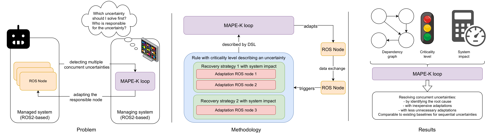

# Resolving concurrent failures in ROS systems



- If you want to know how to run the approach proposed in our paper, just read the [getting started](#getting-started).
- If you want to know how to use our tooling that helps you to apply our approach on a new use case, we recommend the [this documentation](./docs/transfer.md)
- If you want to know how to better understand and extend the managed system used in this study, we refer to [this documentation](./docs/managed_system.md)
- If you want to know better about the general structure of this repository, we refer to [the structure documentation](./docs/structure.md)

# Getting started

## Requirements

- Docker (necessary)
- CUDA (optional if you want to run the segmentation models in the managed subsystem on the GPU)

## Additional data

Download the segmentation models and the ros bags with test data from the a server with the scp command (password `seams`):
=======
Download the segmentation models and the ros bags with test data from the a server with the scp command (password `seams`, fingerprint: SHA256:2JiosHIjBy/5rI8HJsrVCtHeCwRsajRPMWcLrqMKjxs):

```bash
scp seams-reviewer@65.108.55.103:/home/seams-reviewer/data.zip .
```

Unzip and place it inside the ros_ws as a ".data" folder.

```
ros_ws
├── .data
│   ├── chckpoints
│   │   ├── depth.pth
│   │   ├── fusion.pth
│   │   └── rgb.pth
│   └── SynDrone_t01_h50.bag
```

## Replication of results for our ablation study

Run the experiment from the root of the repository with 

```bash
bash ./ros_ws/evaluation/run_multi_experiment.sh
```
The logs will be stored in a folder `log_dump` next to the ros_ws directory.

## Evaluation of log files
To calculate the results in our table, there is a script in the [experiment_setup folder](./ros_ws/src/experiment_setup/experiment_setup/eval_exp_managing_systems.py)
To retrieve our log files you can get them from the same server as above:


## Replication of our results for sequential uncertainties
Use the image described in [this Dockerfile](./Dockerfile).
This has the SUAVE environment installed. 
Mount the [suave_ws](./suave_ws) into the docker container which includes the [adapted bash script](./suave_ws/src/suave/runner/rosa_runner.sh) to start the SUAVE exemplar with our managing system.
You can start the experiment with

```bash
./rosa_runner.sh false bt_mape_k <extended | time> <number runs>

```

## Development

There is a devcontainer file, i.e. you can just open VSCode in the root of this repository and reopen VSCode in the devcontainer.
This should do the rest.

In case you want to visualize the Behaviour Tree that will be run, install [Groot2](https://www.behaviortree.dev/groot/) whereever you like. 
Live visualization is only available in the Pro Version of Groot2 anyway, so we don't bother with that.

