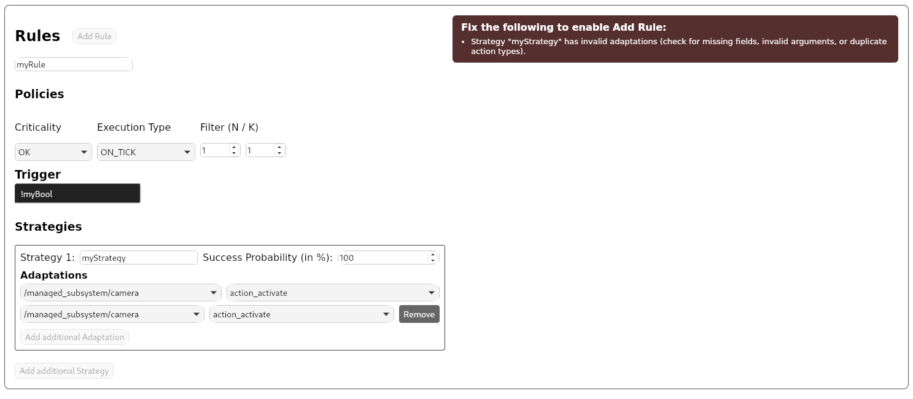
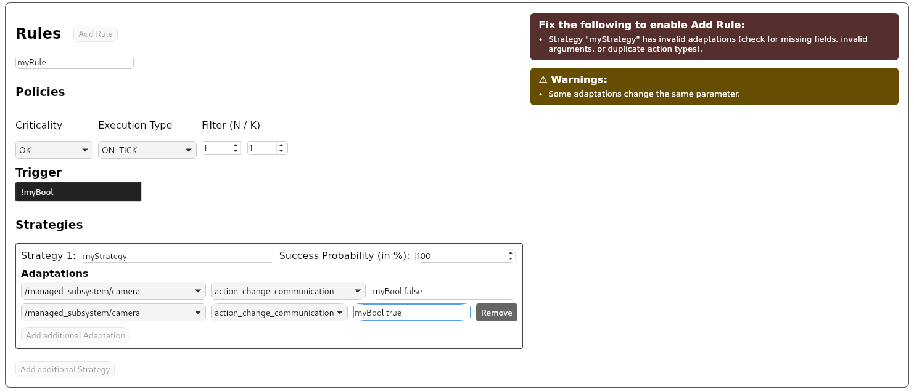
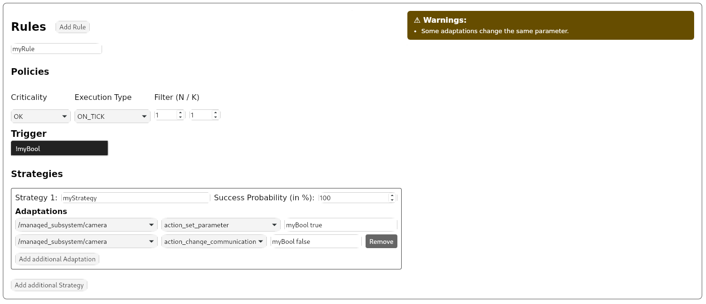

# Resolving concurrent failures in ROS systems


# Getting started

## Requirements

- Docker (necessary)
- CUDA (optional if you want to run the segmentation models in the managed subsystem on the GPU)

## Additional data

Download the segmentation models and the ros bags with test data for SUNSET as described by the [SUNSET authors](https://arxiv.org/abs/2601.13732):

## Replication of results for our ablation study

Run the experiment from the root of the repository with 

```bash
bash ./ros_ws/evaluation/run_multi_experiment.sh [gpu|cpu]
```
The logs will be stored in a folder `log_dump` next to the ros_ws directory.

## Evaluation of log files
To calculate the results in our table, for each table there are scripts in the [experiment_setup folder](./ros_ws/src/experiment_setup/experiment_setup/)


## Development

There is a devcontainer file, i.e. you can just open VSCode in the root of this repository and reopen VSCode in the devcontainer.
This should do the rest.

In case you want to visualize the Behaviour Tree that will be run, install [Groot2](https://www.behaviortree.dev/groot/) whereever you like. 
Live visualization is only available in the Pro Version of Groot2 anyway, so we don't bother with that.


## Set up your own experiment

You need three files:
- `graph_config.json` – needed / blacklisted nodes (namespaces + node names)
- `main_bt.xml` – generated Behavior Tree
- `rules.txt` – adaptation rules (see [Rules for adaptation](#rules-for-adaptation))

Workflow:
1. Run `setup_file_generator.py` (experiment_setup package). It discovers all running ROS 2 nodes and lets you:
   - include / exclude namespaces
   - include / exclude remaining nodes one by one
2. The script writes:
   - `graph_config.json` into the mapek package (config folder)
   - `main_bt.xml` into the bt_mape_k package (bts folder)
3. Build `rules.txt` using the rule_creation GUI (see tools/rule_builder). Load your graph_config.json so component names are available.
4. Render and save rules.txt into bt_mape_k/bts.
5. Launch your experiment.

Rule elements (in the GUI):
- Name
- Policies:
  - Criticality: OK, DEGRADED, FAILURE
  - Execution Type: ON_TICK, ON_CHANGE
  - Filter: n/k 
- Trigger:
  - Must match the regex in ExpressionFactory.hpp (mapek package)
  - Uses constants you define
- Strategies:
  - Name
  - Success probability (%)
  - Adaptations:
    - Component (from graph_config.json)
    - Action Type: activate, deactivate, restart, redeploy, change_communication, set_parameter, increase_parameter, decrease_parameter, change_mode
    - Argument (only for change_communication, set_parameter, increase/decrease_parameter, change_mode)
      - Second argument must be a declared constant or valid expression

Example screens:


### Rule Validation

The rule builder validates your rules to prevent common errors:

**Duplicate Actions on Same Component**

You cannot use the same action (e.g., `redeploy`, `activate`) twice on the same component within a single strategy, as this would create conflicting adaptation instructions:



**Conflicting Communication Changes**

For `change_communication` actions, attempting to change the same parameter twice on the same component is not allowed, as this creates ambiguous communication configurations:



Note: For `set_parameter` actions targeting the same parameter, the rule builder displays a warning but allows the configuration.



These validations ensure that generated adaptation strategies are logically consistent and can be executed without conflicts.

# Structure of the repo

## Top-level
```
mapek-bt/
├── Dockerfile / Dockerfile.cuda / Dockerfile.eval.cuda
├── .devcontainer/
├── ros_ws/
├── suave_ws/
├── tools/
├── docs/
├── figures/
├── log_dump/
├── log/
├── repoStructure.md
└── README.md
```

- Dockerfiles: Container builds (CPU baseline, CUDA for GPU models, eval for lightweight analysis).
- `.devcontainer/`: VS Code development environment (mounts `ros_ws`, sets up colcon + dependencies).
- `ros_ws/`: Primary ROS 2 workspace (packages described below).
- `suave_ws/`: Workspace for the suave use case.
- `tools/`: Standalone helper scripts (bag creation, figure generation, graph tests, subsystem representation, rule builder).
- `docs/`: Domain-specific language layout, UML, examples.
- `figures/`: PNG/SVG diagrams used in documentation/paper.
- `log_dump/`: Aggregated experiment result logs (CSV/JSON) copied from runs.
- `log/`: Build and runtime logs with timestamped folders and `latest` symlinks.

## `ros_ws` core packages
```
ros_ws/src/
├── bt_mape_k/
├── mapek/
├── managed_subsystem/
├── experiment_setup/
├── python_base_class/
├── system_interfaces/
```

### BT_MAPE_K

This package contains the implementation of the Behaviour Tree. 
The [bt_exectutor](ros_ws/src/bt_mape_k/src/bt_executor.cpp) is responsible for building the BT and executing it.
The implementation of the nodes is in the [include](ros_ws/src/bt_mape_k/include/bt_mape_k) directory and in the according src files.

All BTs we develop in this paper can be stored in the [bts](ros_ws/src/bt_mape_k/bts) directory.

- Purpose: Behavior Tree assembly and execution; bridges rules DSL + runtime adaptation.
- Key dirs: `bts/` (XML trees, rules files, init JSON), `include/bt_mape_k/` (custom nodes), `src/` (`bt_executor.cpp`).

### mapek
- Purpose: Implements Monitor, Analyze, Plan, Execute of our approach.
- Key dirs: `src/` (e.g., `analyzer.cpp`), `config/` (dependency graph, blackboard init), `tests/`.
- Role: Correlates executed strategies to rules; manages adaptation timing windows.

### managed_Subsystem, system_interfaces and experiment_setup

This package contains the SUNSET implementation and necessary tools as provided by the authors.

# Configuration

## Rules for adaptation

Current approach for designing a domain specific language for rule definition:
```
BEGIN CONSTS
    double segmentation_entropy 0.0
    double managed_subsystem_depth_camera_freq 2.
    double managed_subsystem_rgb_camera_freq 2.
    double managed_subsystem_segmentation_freq 2.
    double managed_subsystem_sensors_fused_freq 2.
    bool camera_autofocus_needed false
    string rgb_enhanced rgb_enhanced
    string rgb_raw rgb_camera
    int don_t 1
    int know 1
END CONSTS
BEGIN RULES
    RULE AutoFocusNeeded
      POLICIES OK ON_TICK 1/1
      TRIGGER camera_autofocus_needed == true 
      STRATEGY autofocus_strategy 100
          ADAPTATION /managed_subsystem/camera action_set_parameter perform_autofocus true

    RULE SegmentationBad
      POLICIES DEGRADED ON_TICK 1/1
      TRIGGER segmentation_entropy > 0.06
      STRATEGY recalibration 80
          ADAPTATION /managed_subsystem/sensor_fusion action_set_parameter do_recalibration true
      STRATEGY enhancement_activate 12
          ADAPTATION /managed_subsystem/image_enhancement action_activate
          ADAPTATION /managed_subsystem/sensor_fusion action_change_communication topic_camera_input rgb_enhanced
      STRATEGY enhancement_deactivate 8
          ADAPTATION /managed_subsystem/image_enhancement action_deactivate
          ADAPTATION /managed_subsystem/sensor_fusion action_change_communication topic_camera_input rgb_raw

    RULE DepthDead
      POLICIES FAILURE ON_TICK 1/1
      TRIGGER managed_subsystem_depth_camera_freq < 1.
      STRATEGY depth_restart 40
          ADAPTATION /managed_subsystem/depth action_restart
      STRATEGY depth_redeploy 60
          ADAPTATION /managed_subsystem/depth action_redeploy

    RULE SegmentationDead
      POLICIES FAILURE ON_TICK 1/1
      TRIGGER managed_subsystem_segmentation_freq < 1.
      STRATEGY segmentation_restart 40
          ADAPTATION /managed_subsystem/segmentation action_restart
      STRATEGY segmentation_redeploy 60
          ADAPTATION /managed_subsystem/segmentation action_redeploy

    RULE RGBDead
      POLICIES FAILURE ON_TICK 1/1
      TRIGGER managed_subsystem_rgb_camera_freq < 1.
      STRATEGY rgb_restart 40 
          ADAPTATION /managed_subsystem/camera action_restart
      STRATEGY rgb_redeploy 60
          ADAPTATION /managed_subsystem/camera action_redeploy

    RULE SensorFusionDead
      POLICIES FAILURE ON_TICK 1/1
      TRIGGER managed_subsystem_sensors_fused_freq < 1.
      STRATEGY sensor_fusion_restart 40
          ADAPTATION /managed_subsystem/sensor_fusion action_restart
      STRATEGY sensor_fusion_redeploy 60
          ADAPTATION /managed_subsystem/sensor_fusion action_redeploy
END RULES
```

All the variables used in the conditions have to be readable from the blackboard (either blackboard setter sends this values to the BT or you define them via constants)
