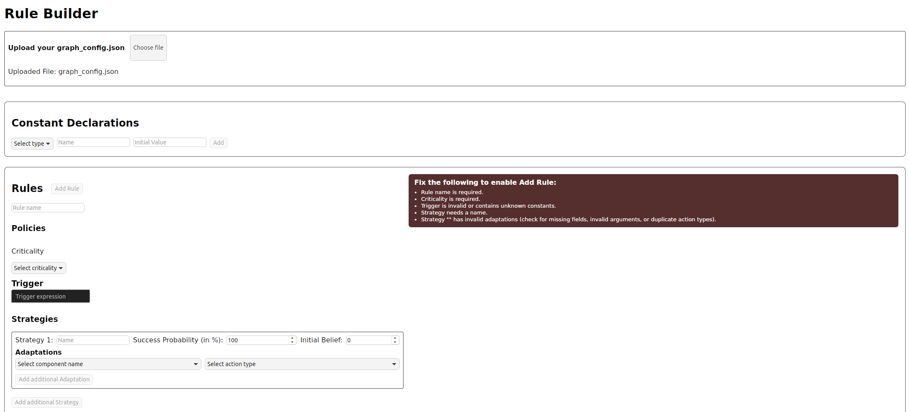
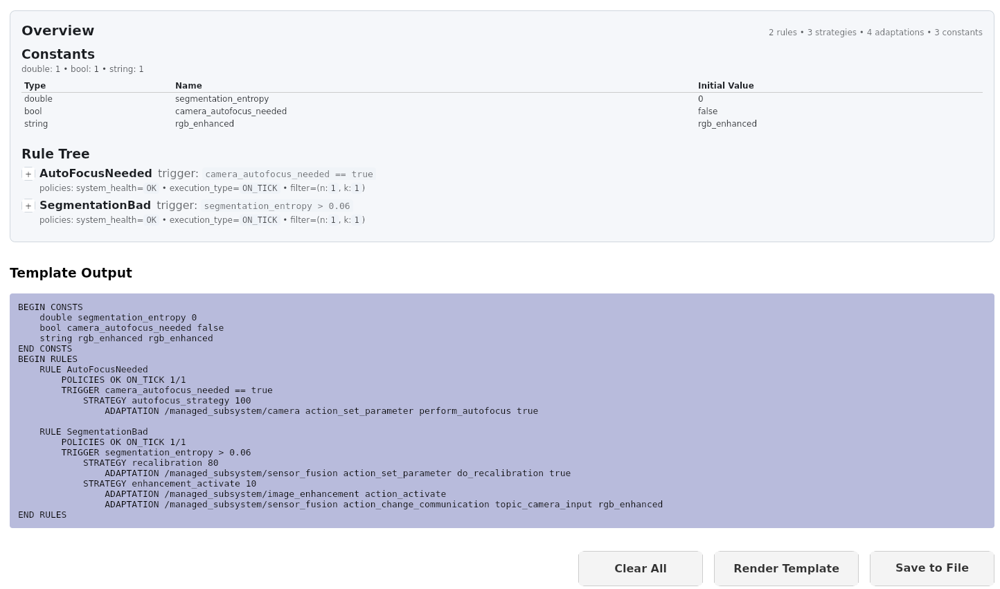

# Use this approach on a new use case

You need three files:
- `graph_config.json` – needed / blacklisted nodes (namespaces + node names)
- `main_bt.xml` – generated Behavior Tree
- `rules.txt` – adaptation rules (see [Rules for adaptation](#rules-for-adaptation))

## Creation of rules for the new use case

[This tool](../tools/rule_builder/rule_creation_app-linux_x64) provides a GUI where you can define your own rule set. 

1. Upload the `graph_config.json` that contains the information about your new managed system
2. Add needed constants (boolean, int, float, string) for the conditions in the trigger of your rules
3. Add your rules:
    - Rules consist of:
        - Name
        - Policies
            - Criticality (OK, DEGRADED, FAILURE)
            - Execution Type (ON_TICK, ON_CHANGE)
            - Filter (n/k)
        - Trigger (not part of the paper but supported by our approach for handling noisy triggers)
            - The constants used in the trigger must be defined in the constants section
        - Strategies
            - Strategy name
            - Success probability (in %)
            - Adaptations
                - Component name (this field is populated with the values from the `graph_config.json`)
                - Action Type ( (de)activate, restart, redeploy, change_communication, set_paramter, in/decrease_parameter, change_mode)
                - Argument (only the actions change_communication, set_parameter, in/decrease_paramter, change_mode require an argument)
                    - The second value in the argument must either be a const declared in the constant sections or a valid expression (like in the trigger) 
4. Render the template
5. Save it in the `bt_mape_k` package under `/bts`

This tool is capable of detecting conflicts inside of a single strategy.
A conflict inside a strategy is defined by multiple adaptations in the same node that are by design not possible, e.g. activating a node after already having activated it in the same strategy.
While conflicts like this are not possible to be added to a rule at all, there is also a warning for potential conflicts, e.g. adjusting the same parameter in one node multiple times in the same strategy.

Example screens:





## Example rule set

This is an excerpt of the [rule set](../ros_ws/src/bt_mape_k/bts/test_rules.txt) that is used in this paper.
```
BEGIN CONSTS
    double segmentation_entropy 0.0
END CONSTS
BEGIN RULES
    RULE SegmentationBad
      POLICIES DEGRADED ON_TICK 1/1
      TRIGGER segmentation_entropy > 0.06
      STRATEGY recalibration 60
          ADAPTATION /managed_subsystem/sensor_fusion action_set_parameter do_recalibration true 10
      STRATEGY enhancement_activate 20
          ADAPTATION /managed_subsystem/image_enhancement action_activate 25
          ADAPTATION /managed_subsystem/sensor_fusion action_change_communication topic_camera_input rgb_enhanced 2
      STRATEGY enhancement_deactivate 20
          ADAPTATION /managed_subsystem/image_enhancement action_deactivate 25
          ADAPTATION /managed_subsystem/sensor_fusion action_change_communication topic_camera_input rgb_raw 2
END RULES
```

All the variables used in the conditions have to be readable from the blackboard (either blackboard setter sends this values to the BT or you define them via constants)

## Guidelines for creating rules

Rule elements (in the GUI):
- Name
- Policies:
  - Criticality: OK, DEGRADED, FAILURE
  - Execution Type: ON_TICK, ON_CHANGE
  - Filter: n/k 
- Trigger:
  - Must match the regex in ExpressionFactory.hpp (mapek package)
  - Uses constants you define
- Strategies:
  - Name
  - Success probability (%)
  - Adaptations:
    - Component (from graph_config.json)
    - Action Type: activate, deactivate, restart, redeploy, change_communication, set_parameter, increase_parameter, decrease_parameter, change_mode
    - Argument (only for change_communication, set_parameter, increase/decrease_parameter, change_mode)
      - Second argument must be a declared constant or valid expression


## graph_config.json & main_bt.xml

Workflow:
1. Run `setup_file_generator.py` (experiment_setup package). It discovers all running ROS 2 nodes and lets you create a graph_config.json file:
   - include / exclude namespaces
   - include / exclude remaining nodes one by one
2. The script writes:
   - `graph_config.json` into the mapek package (config folder)
   - `main_bt.xml` into the bt_mape_k package (bts folder)
3. Render and save rules.txt into bt_mape_k/bts.
4. Launch your experiment.


